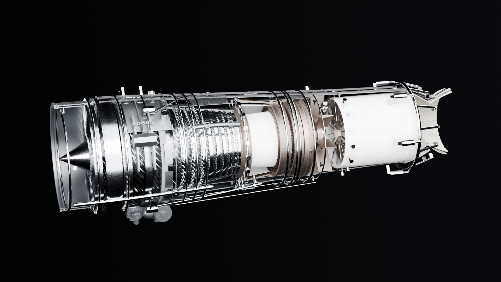

> **This is v1.** It models the GE F110-GE-129 and is kept here as it was, tagged `v1`.
> Version 2 is an original engine designed from scratch, the **Aether AX-1** adaptive-cycle
> turbofan: [github.com/Krabduke/aether-ax1](https://github.com/Krabduke/aether-ax1).

# F110-GE-129 — parametric 3D model

A complete, dimensionally-driven 3D model of the **F110-GE-129** augmented
low-bypass turbofan — the GE engine in the F-16C/D and F-15E — built
procedurally in Blender from a single specification file.

99 named objects · 2,044 individual airfoils · ~856k vertices · builds in ~11 s



## What's modelled

| Module | Contents |
|---|---|
| **Inlet & fan** | Rolled inlet lip, inlet case, 30° ogive spinner, variable IGV, 3 fan stages with individually lofted twisted airfoils, stators, OGV, fan frame |
| **HP compressor** | 9 stages, welded drum rotor, 9 stator rows (first three variable), interstage labyrinth seals |
| **Combustor** | Dump diffuser, annular inner/outer liners with stepped cooling rings and **real perforated dilution holes**, dome, 20 swirlers, 20 fuel nozzles, manifold, 2 igniters |
| **Turbines** | 1-stage HPT + 2-stage LPT, nozzle guide vanes, discs, tip shrouds, blade outer air seals, and **real film-cooling holes** cut into every hot row |
| **Rotating** | Concentric LP and HP shafts, fan disc assembly, HPT/LPT discs, 5 main bearings with races, rolling elements and cages |
| **Augmentor** | 12-lobe forced mixer, perforated screech liner, 16 spraybars, 3-ring V-gutter flameholder with radial gutters |
| **Nozzle** | Variable convergent–divergent nozzle in the max-augmented position: 12 convergent + 12 divergent flaps, interleaved seals, external fairings, unison ring, 6 actuators, 12 links |
| **External** | Casings, bolted flanges with bolt circles, bypass duct and struts, accessory gearbox with pads, tower shaft, fuel/oil lines with clamps, harnesses, mount trunnions |

## Build

Requires Blender (`brew install --cask blender`). Nothing else — no add-ons,
no Python packages.

```
make build      # generate geometry, assemble build/f110.blend, write parts.csv
make verify     # check the built model against spec.py  <- the definition of done
make render     # hero, front, cutaway and exploded views
make export     # build/f110.glb
make web        # decimated GLB for the browser
make stl        # one STL per part, in millimetres
```

## How it's put together

```
engine/
  spec.py        every dimension in the engine. No other file contains a literal
                 dimension; if a number describes the engine, it lives here.
  airfoil.py     NACA section generation, spanwise lofting with twist, platforms,
                 tip shrouds, film-cooling hole placement
  mesh.py        pure-Python primitives: surfaces of revolution, tubes, swept
                 pipes with parallel transport, flanges, bolt rings
  parts/         one module per assembly, all consuming spec.py
  materials.py   PBR alloys — titanium, steel, casing alloy, heat-tinted nickel,
                 ceramic thermal barrier
  assemble.py    the Blender stage: meshes, booleans, arrays, materials,
                 collections, parts.csv
  verify.py      measures the result and asserts it matches spec.py
  render.py      lighting, cameras, the sectioning cut
  export.py      GLB / decimated GLB / per-part STL
```

`engine/` up to and including `parts/` is pure Python with no `bpy` import, so
the geometry can be generated and tested without Blender.

Two details worth knowing:

**Sharp edges are marked explicitly, not by operator.**
`bpy.ops.object.shade_smooth_by_angle` fails silently in background mode, which
leaves every polygon smooth. On a thin-walled tube that averages the outer
wall's normal with the end cap's and the inner wall's, and the result points
*inward* — the surface then samples the environment from the wrong hemisphere
and renders black. `assemble.py` marks sharp edges from face angles directly.

**Cooled blades are cut once, not 72 times.** A hot row is built as a single
prototype blade, perforated with a boolean, and only then arrayed around the
disc. That makes 27 real film-cooling holes per blade affordable.

**The cutaway sections only the outer shell.** Booleaning every object in half
leaves the far half of the casings occluding the core, which renders as a blank
wall. Peeling away just the casings and leaving the rotor whole is both more
readable and how real cutaway display engines are made.

## The browser viewer

```
make web        # build/f110_web.glb  — decimated + Draco, 3.5 MB
make manifest   # viewer/parts.json   — part table, gas path, alloy palette
make viewer     # serve on http://localhost:8777/viewer/
```

An interactive three.js page built around the one thing that actually organises
a jet engine: the **axial station**. The rail along the bottom is a real
millimetre scale from −420 to 4210, and the module bands sit at their true
flowpath stations. Colour encodes gas-path temperature rather than branding.

- **Assembly sequence** (anime.js) — the engine builds itself the way one is
  actually assembled: spool spine first, then the gas path front to back, then
  accessories, then the casings closing over the top. Each module's band on the
  rail lights up as its parts land. `Replay build` runs it again.
- **Throttle quadrant** — Off / Idle / Mil / Max A/B. The spools turn at their
  own speeds and in opposite directions, the core leads the fan on spool-up,
  and N1 / N2 / EGT read out live.
- **Airflow** — particles ride the real annulus, using the same hub and tip
  radii the blades were built from, coloured by total air temperature from
  15 °C at the intake to 1750 °C in the augmentor. Bypass air is tracked as its
  own cooler stream and fades as it mixes.
- **Afterburner** — a two-shell additive plume with shock diamonds, plus heat
  glow on the hot section that follows EGT.
- **Cutaway slider** — peels the casings only, as in the still renders.
- Hovering any part names it and gives its station, alloy and how many are fitted.

Two things worth knowing about the web build. glTF cannot carry the node-driven
colour and roughness used for the Blender renders, so every material arrives at
roughness 1.0 — the viewer reapplies the alloy table from `spec.py` by material
name, which is why `PALETTE` lives in `spec.py` and is shipped in `parts.json`.
And the model is decimated to ~446k faces for the web; the full-resolution GLB
is `build/f110.glb`.

## Accuracy, honestly

**Published figures** (see `SOURCES` in `spec.py`) — length 4,630 mm, max and
fan diameter 1,180 mm, dry weight 1,805 kg, 17,155 lbf dry / ~29,000 lbf
augmented, bypass ratio 0.76, overall pressure ratio 30.7, and the
3-fan/9-HPC/1-HPT/2-LPT architecture.

**Derived, and marked `DERIVED` in `spec.py`** — every axial station, annulus
radius, blade count, chord and twist distribution. GE does not publish these.
They are computed to be self-consistent with the published envelope, bypass
ratio and stage count using standard turbomachinery practice (hub/tip ratios,
stage loading, aspect ratios, solidity ≈ 1.0–1.5). They are
engineering-plausible, **not manufacturer data**.

The splitter radius is not a guess: it is solved from the published bypass ratio
against the fan-exit annulus, and `verify.py` checks the built geometry still
implies 0.76.

This is a **mesh** model, not a B-rep solid — there is no STEP export and no
assembly constraints. Every dimension is real and in millimetres, and `spec.py`
would transfer to a solid-modelling kernel (CadQuery) without rework if that
were ever needed.

## Verification

`make verify` measures the built geometry out of `build/parts.csv` and checks it
against `spec.py` — 46 assertions covering the overall envelope, the fan tip
diameter measured off the blades themselves, every blade row's tip radius
against its annulus, component completeness, material assignment, flowpath
station ordering, and the bypass ratio implied by the splitter radius. It exits
non-zero on any failure.

## License

MIT — see [LICENSE](LICENSE).
